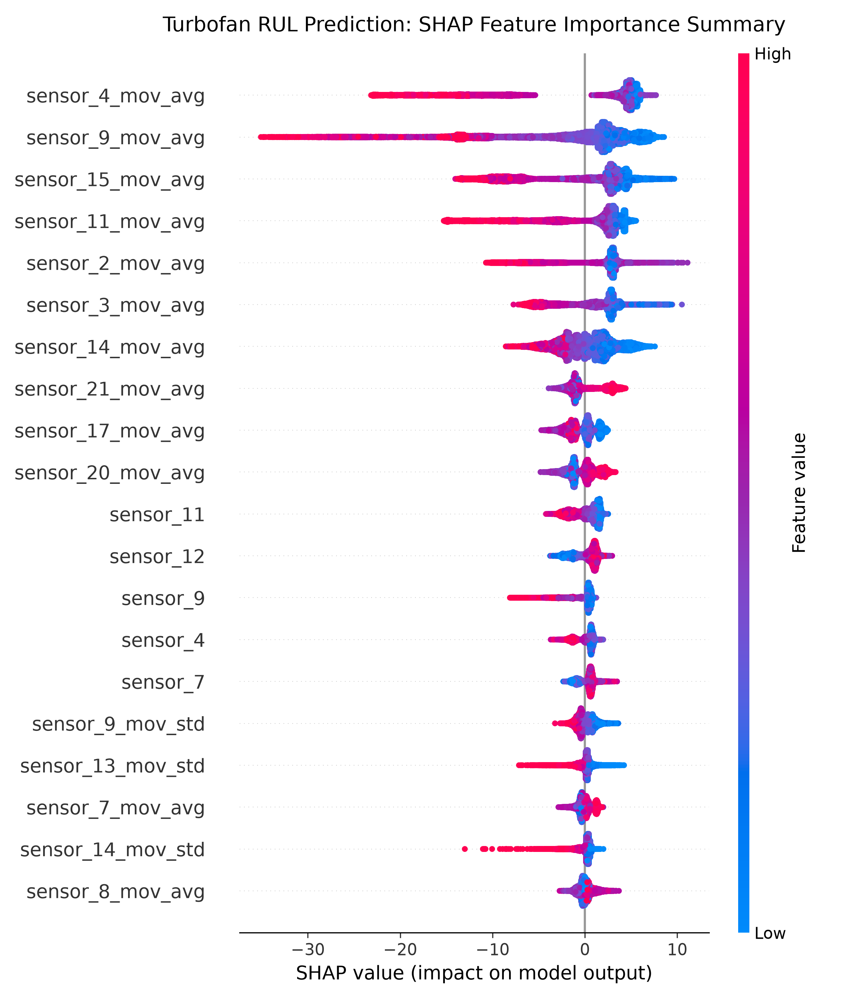

# NASA C-MAPSS Turbofan Predictive Maintenance

An end-to-end Machine Learning Engineering pipeline for predicting the Remaining Useful Life (RUL) of turbofan engines using time-series thermodynamic sensor telemetry from the NASA C-MAPSS dataset (`FD001`).

---

## Executive Summary

Modern aerospace operations rely on condition-based predictive maintenance to prevent catastrophic mid-flight component failure and optimize servicing schedules. This project implements a production-grade machine learning pipeline that predicts engine RUL within approximately 12.8 flight cycles on unseen out-of-sample engines.

### Performance Benchmark Summary

| Evaluation Stage | Primary Model | Feature Matrix | Validation RMSE | Validation MAE |
| :--- | :--- | :--- | :--- | :--- |
| **Baseline (EXP-01)** | Random Forest (100 Trees) | Active Sensors + 10-cycle Rolling Stats | 19.33 ± 0.49 cycles | 13.87 ± 0.77 cycles |
| **Cross-Validation (EXP-02)** | XGBoost Regressor | Active Sensors + 10-cycle Rolling Stats | 18.61 ± 0.57 cycles | 13.54 ± 0.75 cycles |
| **Out-of-Sample Test (EXP-03)**| XGBoost (Production Model)| Final Recorded Cycle per Test Engine | **18.12 cycles** | **12.76 cycles** |

---

## Repository Architecture
predictive-maintenance-turbofan-rul/
├── assets/                  # Visual artifacts and exported SHAP summary plots
├── data/
│   ├── raw/                 # Unformatted C-MAPSS text files (train_FD001, test_FD001, RUL_FD001)
│   └── processed/           # Filtered feature matrices with rolling statistics
├── models/                  # Serialized binary model artifacts (.joblib)
├── src/
│   ├── data_loader.py       # Raw ingestion, schema mapping, zero-variance channel pruning
│   ├── features.py          # 10-cycle rolling aggregations and piecewise RUL clipping
│   ├── train.py             # 5-Fold GroupKFold cross-validation and production training
│   ├── evaluate_test.py     # Out-of-sample evaluation on hidden test datasets
│   ├── explain.py           # Tree-SHAP interpretability and feature ranking generation
│   └── predict.py           # Real-time CLI inference engine and safety alert system
├── PROJECT_LOG.md           # Granular engineering decision log and mathematical rationales
└── README.md                # Master repository documentation

---

## Non-Technical Overview

1. **Objective:** Replaces fixed-interval servicing with dynamic sensor monitoring to predict exact remaining flight cycles before component failure occurs.
2. **Channel Pruning:** Identifies and drops seven static sensor channels that provide zero variance, reducing computational overhead and tree split noise.
3. **Signal Smoothing:** Applies 10-cycle rolling averages to filter transient operational noise from core mechanical wear signals.
4. **Target Clipping:** Caps healthy engine RUL values at 125 cycles to prevent early-life predictions from distorting late-stage degradation curves.
5. **Grouped Cross-Validation:** Enforces `GroupKFold` split boundaries by engine unit ID, eliminating temporal data leakage across training iterations.
6. **Model Selection:** Employs XGBoost sequential residual fitting to outperform traditional bagging ensemble baselines.
7. **Explainability:** Utilizes Tree-SHAP analysis to verify that predictions align with actual physical wear, primarily driven by high-pressure turbine temperatures and pressure dynamics.
8. **Inference Interface:** Features an operational command-line interface (CLI) that ingests raw telemetry and outputs instant risk classifications (**HEALTHY**, **WARNING**, **CRITICAL**).

---

## Technical Architectural Log

### Phase 1: Infrastructure and Software Decoupling
Mixing data processing and model training scripts into monolithic loops introduces software coupling and validation leakage. This architecture enforces separation between data ingestion (`src/data_loader.py`), feature transformation (`src/features.py`), cross-validation training (`src/train.py`), test evaluation (`src/evaluate_test.py`), explainability (`src/explain.py`), and operational inference (`src/predict.py`). All pathing is handled via Python `pathlib` for cross-platform container portability.

### Phase 2: Data Ingestion and Schema Mapping
The raw C-MAPSS telemetry dataset consists of unformatted, space-delimited text files lacking headers. A strict 26-column schema mapping 3 operational settings and 21 thermodynamic sensor channels was defined to parse incoming text streams into structured tabular DataFrames.

### Phase 3: Variance Profiling and Low-Variance Pruning
Standard deviation profiling identified seven static channels with variance $\sigma < 10^{-4}$: `setting_3`, `sensor_1`, `sensor_5`, `sensor_10`, `sensor_16`, `sensor_18`, and `sensor_19`. These static attributes represent locked control variables or uncalibrated streams. Pruning these channels reduced feature space dimensionality from 26 to 19 clean base columns without sacrificing signal integrity.

### Phase 4: Target Formulation and Piecewise Linear RUL Clipping
Target Remaining Useful Life ($RUL_{i,t}$) is computed grouped by engine unit (`unit_nr`):

$$RUL_{i,t} = T_{i,\text{max}} - t$$

Because components exhibit negligible physical wear during early operation, fitting an unclipped linear regression target forces models to attempt separating identical healthy states. To match true physical degradation dynamics, targets are capped using a piecewise linear threshold at 125 cycles:

$$RUL_{\text{piecewise}} = \min(125, T_{i,\text{max}} - t)$$

### Phase 5: Time-Series Feature Engineering
To capture long-term thermodynamic degradation while filtering high-frequency operational noise, 10-cycle window rolling statistics are computed for all active sensor streams:

$$\text{Rolling Mean}_{i,t} = \frac{1}{W} \sum_{k=0}^{W-1} S_{i, t-k}$$

$$\text{Rolling Std}_{i,t} = \sqrt{\frac{1}{W-1} \sum_{k=0}^{W-1} (S_{i, t-k} - \bar{S}_{i,t})^2}$$

* **Rolling Mean:** Low-pass filter exposing underlying thermodynamic component drift.
* **Rolling Standard Deviation:** Captures physical vibration and thermal instability near failure boundaries.
* **Grouping Constraint:** Aggregations are grouped strictly by `unit_nr` to prevent window leakage across engine unit boundaries.

### Phase 6: Group Cross-Validation Strategy
Standard random $K$-fold cross-validation is invalid for grouped time-series telemetry because row shuffling places adjacent cycles of the same engine in both training and validation splits. `GroupKFold` cross-validation grouped by `unit_nr` isolates entire engine lifespans into distinct folds, testing out-of-sample generalization to unseen flight units.

### Phase 7: Evaluation Framework
Model performance is tracked using Root Mean Squared Error (RMSE) and Mean Absolute Error (MAE):

$$\text{RMSE} = \sqrt{\frac{1}{N} \sum_{i=1}^N (y_i - \hat{y}_i)^2}$$

$$\text{MAE} = \frac{1}{N} \sum_{i=1}^N |y_i - \hat{y}_i|$$

Quadratic error penalization in RMSE heavily weights large over-predictions, mitigating catastrophic failure risks in operational settings.

### Phase 8: Out-of-Sample Test Evaluation
The NASA C-MAPSS test set (`test_FD001.txt`) truncates engine telemetry at an arbitrary operational cycle prior to failure. The evaluation pipeline extracts only the final recorded cycle per test engine (`groupby("unit_nr").last()`) and evaluates predictions against ground-truth targets (`RUL_FD001.txt`). 
* **Test RMSE:** 18.12 cycles
* **Test MAE:** 12.76 cycles

The close alignment between GroupKFold CV RMSE (18.61) and Test Set RMSE (18.12) confirms zero feature leakage and strong generalization.

### Phase 9: Model Interpretability (Explainable AI)
Tree-SHAP (SHapley Additive exPlanations) was integrated to inspect global feature contributions:
* **Primary Features:** Moving averages of high-pressure turbine outlet temperatures (`sensor_4_mov_avg`) drive **38.7%** of model output decisions. High-pressure turbine discharge pressure (`sensor_11_mov_avg`) and bypass ratio (`sensor_15_mov_avg`) contribute an additional **26.0%**.
* **Instability Drivers:** Rolling standard deviation features (`_mov_std`) show strong positive SHAP value shifts during late engine lifespans, confirming the model leverages physical sensor jitter as a leading indicator of imminent failure.

### Phase 10: Real-Time CLI Inference Pipeline
`src/predict.py` provides a production-ready command-line interface for deployed asset monitoring. It ingests unformatted engine logs, performs global variance pruning and rolling statistics, aligns feature column order against `model.feature_names_in_`, and maps predicted RUL values to operational risk categories:
* $RUL \le 20$: **CRITICAL (Immediate Maintenance Required)**
* $20 < RUL \le 50$: **WARNING (Schedule Inspection)**
* $RUL > 50$: **HEALTHY (Normal Operations)**

---

## Pipeline Feature Transformation Summary

| Phase | Input Dimension | Output Dimension | Core Transformation | Target Script |
| :--- | :--- | :--- | :--- | :--- |
| **01. Ingestion** | Raw text stream | `(20631, 26)` | Space-delimited parsing & schema assignment | `src/data_loader.py` |
| **02. Pruning** | `(20631, 26)` | `(20631, 19)` | Static channel filtering ($\sigma < 10^{-4}$) | `src/data_loader.py` |
| **03. RUL Generation** | `(20631, 19)` | `(20631, 20)` | Maximum cycle calculation per unit | `src/data_loader.py` |
| **04. Feature Eng.** | `(20631, 20)` | `(20631, 51)` | 10-cycle rolling stats + 125 RUL clipping | `src/features.py` |
| **05. Validation** | `(20631, 51)` | 5 Fold Splits | GroupKFold partitioning by engine ID | `src/train.py` |
| **06. Test Evaluation**| Test stream | `(100, 47)` | Slice final operational cycle per test unit | `src/evaluate_test.py` |
| **07. Interpretability**| Processed Matrix | `(20631, 47)` | Tree-SHAP matrix evaluation & plot export | `src/explain.py` |
| **08. CLI Inference** | Raw unit log | `(1, 47)` | Single-engine schema alignment & risk output | `src/predict.py` |

---

## Model Interpretability Visuals



---

## Instructions for Execution

### 1. Ingestion and Feature Engineering
```bash
  python src/data_loader.py
  python src/features.py
  python src/train.py
  python src/evaluate_test.py
  python src/explain.py
  python src/predict.py --unit 1
  python src/predict.py --unit 24
